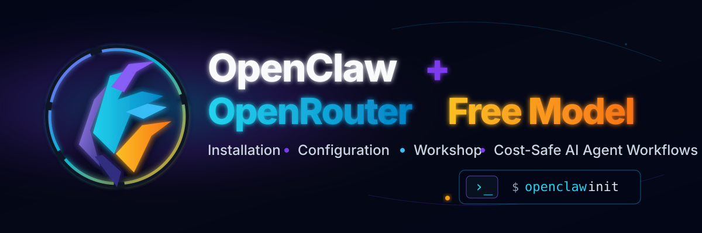

<p align="center">
  
</p>

# OpenClaw + OpenRouter Free Model


> A practical English (US) guide for installing, configuring, teaching, and operating **OpenClaw** with **OpenRouter Free Models**. This repository focuses on real-world usage, cost control, API-key safety, classroom workshops, and AI-agent automation.

---

## Table of Contents

- [Overview](#overview)
- [Who This Repository Is For](#who-this-repository-is-for)
- [Repository Files](#repository-files)
- [Quick Start](#quick-start)
- [Installation](#installation)
- [OpenRouter Setup](#openrouter-setup)
- [Model Strategy](#model-strategy)
- [Free Model Operating Rules](#free-model-operating-rules)
- [Security and Token Hygiene](#security-and-token-hygiene)
- [Troubleshooting](#troubleshooting)
- [Workshop Mode](#workshop-mode)
- [External References](#external-references)
- [License](#license)

---

## Overview

**OpenClaw** is an AI-agent gateway and orchestration layer. It connects users, channels, model providers, and tools so an AI workflow can operate through a Dashboard, CLI, Telegram, Cron automation, local files, and external providers.

This repository provides a practical operating guide for using OpenClaw with **OpenRouter Free Models**. It is designed for installation, configuration, teaching, demo workflows, and cost-safe AI-agent experimentation.

### Code Reading Standard

All command examples use explicit GitHub Markdown code-fence language tags such as `bash`, `console`, `text`, and `markdown`. Shell examples include normal Thai teaching comments starting with `#` so instructors and learners can understand why each command is used.

> GitHub controls code colors from the language tag after the opening code fence. Markdown itself cannot force custom colors without external CSS.

### Core Goals

1. Install and verify OpenClaw.
2. Connect OpenRouter safely.
3. Use free or cost-sensitive models with lower billing risk.
4. Build workflows for Dashboard, Telegram, Web Search, Cron, and local files.
5. Teach OpenClaw concepts in IT, AI-agent, automation, or digital-business courses.

---

## Who This Repository Is For

| Audience | Use Case |
|---|---|
| New AI-agent users | Install OpenClaw and test OpenRouter models. |
| IT instructors and trainers | Run a step-by-step workshop. |
| IT / CS / Software Engineering students | Understand AI-agent architecture and model routing. |
| Developers and automation users | Configure Cron, Telegram, Web Search, and file workflows. |
| Knowledge workers | Use an AI agent to summarize, classify, and organize information. |

---

## Repository Files

| File | Purpose |
|---|---|
| `README.md` | Main repository landing page and quick operating guide. |
| `assets/openclaw-openrouter-free-model-banner.svg` | Repository title / brand banner for the README header. |
| `openclaw_openrouter_free_model_installation_manual_th.md` | English (US) installation and operation manual. The filename is preserved for backward compatibility. |
| `openclaw_openai_gpt_5_x_lesson_th.md` | English (US) instructor lesson plan. The filename is preserved for backward compatibility. |
| `LICENSE` | MIT License. |

> Note: Some filenames still contain `_th` because earlier versions were written in Thai. The content has been converted to English (US). Rename files only after confirming that no external links depend on the current filenames.

---

## Quick Start

Use this flow for a short workshop demo:

```bash
# ติดตั้ง OpenClaw เวอร์ชันล่าสุดแบบ global เพื่อเรียกคำสั่ง openclaw ได้จาก terminal
npm install -g openclaw@latest

# เริ่มกระบวนการตั้งค่าเริ่มต้น และติดตั้ง daemon/service สำหรับใช้งานเบื้องหลัง
openclaw onboard --install-daemon

# ตรวจสอบเวอร์ชันและสุขภาพระบบก่อนเริ่มสอนหรือเริ่ม demo
openclaw --version
openclaw doctor
openclaw gateway status

# เปิด Dashboard เพื่อให้ผู้เรียนเห็นภาพรวมการใช้งานผ่าน UI
openclaw dashboard
```

Then connect OpenRouter and test model status:

```bash
# เข้าสู่ระบบ provider OpenRouter เพื่อให้ OpenClaw เรียกโมเดลผ่าน OpenRouter ได้
openclaw models auth login --provider openrouter

# ตรวจสอบสถานะโมเดลและทดสอบ probe เพื่อยืนยันว่าพร้อมใช้งานจริง
openclaw models status
openclaw models status --probe
```

---

## Installation

### Option A: Installer Script

```bash
# ใช้ installer script เมื่ออยากติดตั้งแบบรวดเร็วตามวิธีที่โครงการ OpenClaw แนะนำ
curl -fsSL https://openclaw.ai/install.sh | bash
```

### Option B: npm

```bash
# ใช้วิธี npm เมื่อเครื่องมี Node.js และ npm พร้อมใช้งานแล้ว
npm install -g openclaw@latest

# ตั้งค่าเริ่มต้นหลังติดตั้ง เพื่อให้ OpenClaw พร้อมใช้งานเป็น agent gateway
openclaw onboard --install-daemon
```

### Verify Installation

```bash
# ตรวจสอบเวอร์ชัน โปรแกรมวินิจฉัย และสถานะ gateway ก่อนใช้งานจริง
openclaw --version
openclaw doctor
openclaw gateway status
```

Expected result:

```console
# ผลลัพธ์ตัวอย่างที่ต้องการเห็น แปลว่า gateway และ dashboard พร้อมใช้งาน
Gateway: running
Dashboard: http://127.0.0.1:18789/
Connectivity probe: ok
```

---

## OpenRouter Setup

1. Sign in to OpenRouter.
2. Create an API key.
3. Store the key in a password manager.
4. Connect the provider in OpenClaw.

```bash
# เชื่อม OpenRouter กับ OpenClaw ด้วยขั้นตอน login ของ provider
openclaw models auth login --provider openrouter

# ตรวจรายการ provider ที่ authenticate แล้ว และตรวจสถานะ model routing
openclaw models auth list
openclaw models status
openclaw models status --probe
```

Alternative API-key onboarding flow:

```bash
# ตั้งค่า environment variable ชั่วคราว อย่า commit ค่า key จริงลง GitHub
export OPENROUTER_API_KEY="<your-openrouter-api-key>"

# ใช้ API key เพื่อ onboarding โดยระบุ provider เป็น openrouter อย่างชัดเจน
openclaw onboard --auth-choice apiKey --token-provider openrouter --token "$OPENROUTER_API_KEY"
```

---

## Model Strategy

OpenClaw uses provider-qualified model references:

```text
# รูปแบบอ้างอิงโมเดลพื้นฐานคือ provider/model ไม่ใช่แค่ชื่อโมเดลลอย ๆ
provider/model
```

For OpenRouter models, use a fully qualified reference:

```text
# ระบุ provider และ model-id ให้ครบเพื่อลดความสับสนระหว่าง slug ของ OpenRouter กับ model ref ของ OpenClaw
openrouter/<provider>/<model-id>
openrouter/<provider>/<model-id>:free
```

Recommended workflow:

```bash
# ดูรายการโมเดล OpenRouter ที่ OpenClaw เห็นในขณะนั้น
openclaw models list --provider openrouter

# scan เพื่อตรวจ model catalog/availability ก่อนเลือกใช้ใน workshop
openclaw models scan

# ตั้ง primary model โดยใช้ ref แบบเต็ม และเลือก variant ที่ระบุ :free เมื่อจำเป็นต้องคุมต้นทุน
openclaw models set "openrouter/<provider>/<model-id>:free"

# restart gateway หลังเปลี่ยน configuration เพื่อให้ค่าใหม่ถูกโหลด
openclaw gateway restart

# probe เพื่อยืนยันว่าโมเดลเรียกใช้งานได้จริง ไม่ใช่แค่ตั้งค่าไว้เฉย ๆ
openclaw models status --probe
```

### Classroom Safe Default

```markdown
# ค่าเริ่มต้นสำหรับการสอนควรควบคุมต้นทุนและลดความเสี่ยงก่อนเพิ่มความซับซ้อน
Primary model  = verified free model
Fallback model = verified free model
Output limit   = short
Tool calls     = minimal
PDF reading    = avoid full-document reading
Cron frequency = low
```

---

## Free Model Operating Rules

Free-model availability, rate limits, latency, context size, and tool support can change. Verify the model list before teaching or running a public demo.

Recommended rules:

1. Check the catalog before the demo.
2. Avoid `auto` if you require strict free-only behavior.
3. Use exact model refs when teaching.
4. Limit prompt size and output length.
5. Avoid asking the agent to read large files in full.
6. Do not run Cron too frequently.
7. Check logs after the demo.

---

## Security and Token Hygiene

Never expose:

```markdown
# รายการด้านล่างคือข้อมูลลับ ห้ามแปะใน repo, slide, chat, log หรือหน้าจอที่แชร์
API keys
Gateway tokens
Telegram bot tokens
Passwords
Session tokens
.env files
auth profiles
```

Recommended practice:

- Store keys in a password manager.
- Use environment variables only when needed.
- Do not paste secrets into public chat or GitHub files.
- Rotate a key immediately if it may have been exposed.
- Review logs before sharing them.
- Back up configuration files before making changes.

---

## Troubleshooting

| Symptom | Likely Cause | Recommended Action |
|---|---|---|
| `401` or missing authentication | API key not configured or expired | Re-check provider auth and rotate the key if needed. |
| Gateway not running | OpenClaw service stopped | Run `openclaw gateway status` and restart the gateway. |
| `web_search is disabled` | No web provider configured | Run `openclaw configure --section web`. |
| Billing or credit warning | Paid model selected accidentally | Verify the selected model and fallback list. |
| Slow response | Free model rate limits or provider congestion | Switch to another verified free model or reduce workload. |
| Context overflow | Prompt, history, or files are too large | Summarize first, split the task, or reduce output length. |

---

## Workshop Mode

Recommended 90–180 minute workshop flow:

1. Explain AI-agent architecture.
2. Install and verify OpenClaw.
3. Connect OpenRouter.
4. Select a free/cost-safe model.
5. Run a short Dashboard or CLI demo.
6. Discuss security and token hygiene.
7. Assign a small lab using safe dummy data.

Suggested lab:

```markdown
# ตัวอย่างโจทย์ lab ใช้ข้อมูลสมมติเท่านั้น เพื่อไม่ให้มีข้อมูลลับหรือข้อมูลส่วนบุคคลหลุดเข้า agent
Create a short AI-agent workflow that summarizes a local Markdown note,
classifies it into a category, and writes a short output file.
Do not use real secrets, customer data, or private files.
```

---

## External References

Use the official OpenClaw and OpenRouter documentation as the primary source for current commands, provider behavior, and model availability.

Recommended source categories:

- OpenClaw installation and CLI documentation
- OpenClaw model provider documentation
- OpenRouter provider documentation
- OpenRouter model catalog and free-model router documentation
- OpenRouter API quickstart documentation

---

## License

This repository is released under the MIT License. See [`LICENSE`](LICENSE) for details.
